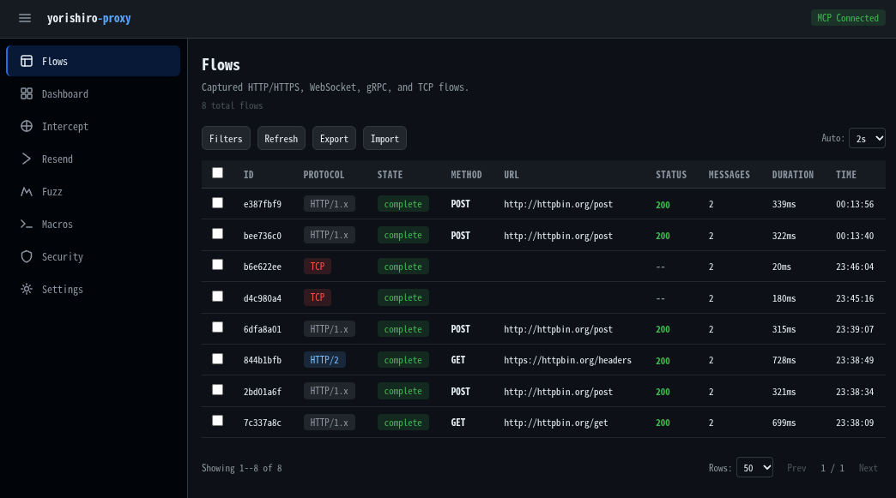

<p align="center">
  
</p>

<p align="center">
  <strong>AI-First MITM プロキシツール</strong><br>
  AI エージェントのためのネットワークプロキシ — MCP を通じてトラフィックを傍受・記録・リプレイ
</p>

<p align="center">
  <a href="https://github.com/usk6666/yorishiro-proxy/actions/workflows/ci.yml"></a>
  <a href="https://goreportcard.com/report/github.com/usk6666/yorishiro-proxy"></a>
  <a href="LICENSE"></a>
</p>

<p align="center">
  <a href="README.md">English</a>
</p>

> **Beta** — yorishiro-proxy は開発中です. APIs, configuration formats, and protocol など、マイナーバージョン間でも変更される可能性があります。Non-HTTP/HTTPS プロトコル (gRPC, WebSocket, Raw TCP, SOCKS5など) も実験的な機能提供段階です。

---

Yorishiro Proxy は [MCP (Model Context Protocol)](https://modelcontextprotocol.io/) サーバとして動作し、11 個の MCP ツールを通じて AI エージェントにプロキシ操作の完全な制御を提供します。Claude Code やその他の MCP 対応エージェントと組み合わせることで、手動の UI 操作なしに自動化されたセキュリティテストワークフローを実現します。ビジュアル確認やインタラクティブな操作のための組み込み Web UI も利用できます。

<p align="center">
  
</p>

## 機能

- **トラフィック傍受・記録** -- 自動 CA 証明書管理付き MITM プロキシ
- **Resender** -- ヘッダ/ボディ/URL のオーバーライド、JSON パッチ、生 HTTP 編集によるリクエストリプレイ
- **Fuzzer** -- シーケンシャル/パラレルモードと非同期実行による自動ペイロードインジェクション
- **Macro** -- 変数抽出とテンプレート置換によるマルチステップリクエストシーケンス
- **Intercept** -- リクエスト/レスポンスをリアルタイムで保持・検査し、リリース・変更・ドロップ
- **Auto-Transform** -- マッチするトラフィックへの自動リクエスト/レスポンス変更ルール
- **Target Scope** -- 到達可能なホストを制限する 2 層セキュリティ境界（Policy + Agent）
- **マルチプロトコル** -- HTTP/1.x, HTTPS (MITM), HTTP/2 (h2c/h2), gRPC, WebSocket, Raw TCP, SOCKS5
- **マルチリスナ** -- 異なるポートで複数のプロキシリスナを同時実行
- **mTLS クライアント証明書** -- ホスト単位のクライアント証明書による相互 TLS 認証
- **TLS 検証制御** -- ホスト単位の TLS 検証設定とカスタム CA 指定
- **フロータイミング** -- フェーズ別タイミング記録（DNS、接続、TLS ハンドシェイク、リクエスト、レスポンス）
- **フローエクスポート/インポート** -- JSONL、HAR 1.2、cURL エクスポート形式
- **SOCKS5 リスナ** -- proxychains 連携のための SOCKS5 プロキシ（オプションのユーザ名/パスワード認証付き）
- **上流プロキシ** -- HTTP または SOCKS5 プロキシ経由のチェーン接続
- **Streamable HTTP MCP** -- Bearer トークン認証によるマルチエージェント共有アクセス
- **Comparer** -- 2 フロー間の構造化 diff（ステータスコード、ヘッダ、ボディ長、タイミング、JSON キーレベル diff）
- **AI Safety** -- SafetyFilter の Input Filter が破壊的ペイロード（DROP TABLE、rm -rf 等）をブロック。Output Filter がレスポンス内の PII（クレジットカード番号、メールアドレス、電話番号等）を AI エージェントへの返却前にマスク（生データは Flow Store に保存）。レート制限（グローバル/ホスト別 RPS）と診断バジェット（リクエスト数/時間制限）による 2 層 Policy+Agent アーキテクチャ
- **プラグインシステム** -- [Starlark](https://github.com/google/starlark-go) スクリプトでプロキシのリクエスト/レスポンスパイプラインを拡張
- **Web UI** -- ビジュアル確認とインタラクティブテストのための組み込み React/Vite ダッシュボード

## クイックスタート

### 1. バイナリの取得

[GitHub Releases](https://github.com/usk6666/yorishiro-proxy/releases) ページからビルド済みバイナリをダウンロードするか、ソースからビルド:

```bash
git clone https://github.com/usk6666/yorishiro-proxy.git
cd yorishiro-proxy
make build    # bin/yorishiro-proxy に出力
```

### 2. MCP の設定

`install` サブコマンドで MCP 連携を簡単にセットアップできます:

```bash
# 現在のプロジェクト用に設定（.mcp.json を生成）
yorishiro-proxy install mcp

# ユーザレベルで設定（~/.claude/settings.json）
yorishiro-proxy install mcp --user-scope
```

Claude Code などの MCP クライアントに最適な設定（stdio MCP トランスポート有効、ログ出力をファイルにリダイレクト）が自動生成されます。

CA 証明書は初回実行時に自動生成され、`~/.yorishiro-proxy/ca/` に保存されます。

### 3. サーバの単独起動

サーバを直接起動することもできます。デフォルトではランダムなループバックポートで HTTP MCP サーバが起動し、接続情報が `~/.yorishiro-proxy/server.json` に書き込まれます:

```bash
# デフォルト設定で起動
yorishiro-proxy server

# 固定ポートでブラウザ自動オープン
yorishiro-proxy server -mcp-http-addr 127.0.0.1:3000 -open-browser
```

起動時にログに認証トークン付きの Web UI URL が出力されます:

```
WebUI available url=http://127.0.0.1:3000/?token=<random-token>
```

### 4. 最初のキャプチャ

MCP サーバが起動したら、AI エージェントからトラフィックキャプチャを開始できます:

```
1. プロキシを起動        -> proxy_start で listen_addr "127.0.0.1:8080"
2. HTTP_PROXY を設定     -> 対象アプリケーションをプロキシに向ける
3. CA 証明書をインストール -> query ca_cert で証明書パスを取得
4. トラフィックを発生     -> query flows でキャプチャされたフローを確認
5. 検査・リプレイ        -> resend で変更を加えてリプレイ
```

## MCP ツール

すべてのプロキシ操作は 11 個の MCP ツールとして公開されます:

| ツール | 用途 |
|--------|------|
| `proxy_start` | キャプチャスコープ、TLS パススルー、インターセプトルール、Auto-Transform、TCP フォワーディング、プロトコル設定付きでプロキシリスナを起動 |
| `proxy_stop` | 1 つまたはすべてのリスナのグレースフルシャットダウン |
| `configure` | ランタイム設定変更（上流プロキシ、キャプチャスコープ、TLS パススルー、インターセプトルール、Auto-Transform、接続制限） |
| `query` | 統合情報取得: フロー、フロー詳細、メッセージ、プロキシステータス、設定、CA 証明書、インターセプトキュー、マクロ、Fuzz ジョブ/結果 |
| `resend` | 記録されたリクエストをミューテーション付きでリプレイ（メソッド/URL/ヘッダ/ボディのオーバーライド、JSON パッチ、生バイトパッチ、ドライラン）および 2 フローの構造化比較 |
| `fuzz` | ペイロードセット、ポジション、並行制御、停止条件付きの Fuzz テストキャンペーンを実行 |
| `macro` | 変数抽出、ガード、フック付きのマルチステップマクロワークフローを定義・実行 |
| `intercept` | インターセプトされたリクエストに対してリリース、変更して転送、またはドロップ |
| `manage` | フローデータの管理（削除/エクスポート/インポート）と CA 証明書の再生成 |
| `security` | Target Scope ルール、レート制限、診断バジェットの設定（Policy Layer + Agent Layer） |
| `plugin` | Starlark プラグインの一覧表示、リロード、有効化、無効化をランタイムで実行 |

## Web UI

組み込み Web UI は HTTP MCP アドレスで提供されます（デフォルトで有効）。

| ページ | 説明 |
|--------|------|
| **Flows** | プロトコル、メソッド、ステータスコード、URL パターンによるフィルタリング付きフロー一覧 |
| **Dashboard** | リアルタイムトラフィックサマリー付きフロー統計概要 |
| **Intercept** | インライン編集付きリアルタイムリクエスト/レスポンスインターセプト |
| **Resender** | オーバーライド、JSON パッチ、生 HTTP 編集、ドライランプレビュー付きリクエストリプレイ |
| **Fuzz** | ペイロードセットと結果分析付きの Fuzz キャンペーン作成・管理 |
| **Macros** | 変数抽出付きマルチステップリクエストワークフロー |
| **Security** | URL テスト付き Target Scope 設定（Policy + Agent Layer） |
| **Settings** | プロキシ制御、TLS パススルー、Auto-Transform ルール、CA 管理など |

Web UI は Streamable HTTP MCP でバックエンドと通信します — AI エージェントと同じプロトコルです。

## 対応プロトコル

| プロトコル | 検出方式 | 備考 |
|-----------|---------|------|
| HTTP/1.x | 自動 | フォワードプロキシモード |
| HTTPS | CONNECT | 動的証明書発行による MITM |
| HTTP/2 | h2c / ALPN | クリアテキスト・TLS 両対応、ストリーム単位のフロー表示 |
| gRPC | HTTP/2 content-type | サービス/メソッド抽出、ストリーミング対応、構造化メタデータ表示 |
| WebSocket | HTTP Upgrade | メッセージ単位の記録・表示 |
| Raw TCP | フォールバック | 認識されないプロトコルをキャプチャ、TCP フォワーディングマッピング対応 |

## CLI

yorishiro-proxy は以下のサブコマンドを提供します:

| サブコマンド | 説明 |
|------------|------|
| `server` | プロキシサーバを起動（サブコマンド省略時のデフォルト） |
| `client` | 実行中のサーバに対して CLI で MCP ツールを呼び出し |
| `install` | コンポーネントのインストール・設定（MCP, CA, Skills, Playwright） |
| `upgrade` | GitHub Releases からアップデートを確認・インストール |
| `version` | バージョン情報を表示 |

`client` サブコマンドは実行中のサーバに接続し、`key=value` パラメータで MCP ツールを呼び出します。スクリプティングやアドホックなペンテストワークフローに便利です:

```bash
yorishiro-proxy client query resource=status
yorishiro-proxy client proxy_start listen_addr=127.0.0.1:8080
yorishiro-proxy client query resource=flows limit=10
```

サーバフラグ、クライアントオプション、環境変数の全一覧は `yorishiro-proxy server -help` / `yorishiro-proxy client -help` を実行するか、[ドキュメント](https://usk6666.github.io/yorishiro-proxy-docs/)を参照してください。

## アーキテクチャ

```
Layer 4 TCP リスナ
  → プロトコル検出 (peek bytes)
    → プロトコルハンドラ (HTTP/S, HTTP/2, gRPC, WebSocket, Raw TCP)
      → フロー記録 (Request/Response)
        → MCP ツール (傍受 / リプレイ / 検索)
```

- Layer 4 (TCP) でコネクションを受け取り、モジュラー化されたプロトコルハンドラにルーティング
- 外部プロキシライブラリ不使用 — Go 標準ライブラリベースで構築
- MCP-first: すべての操作は MCP ツールとして排他的に公開
- React/Vite で構築された組み込み Web UI を Streamable HTTP 経由で提供

## ドキュメント

ドキュメントは **[usk6666.github.io/yorishiro-proxy-docs](https://usk6666.github.io/yorishiro-proxy-docs/)** で公開しています。

## コントリビューション

コントリビューションを歓迎します！変更を加える前に、まず Issue を開いて議論してください。

## ライセンス

Apache License, Version 2.0 の下でライセンスされています。全文は [LICENSE](LICENSE) を参照してください。
